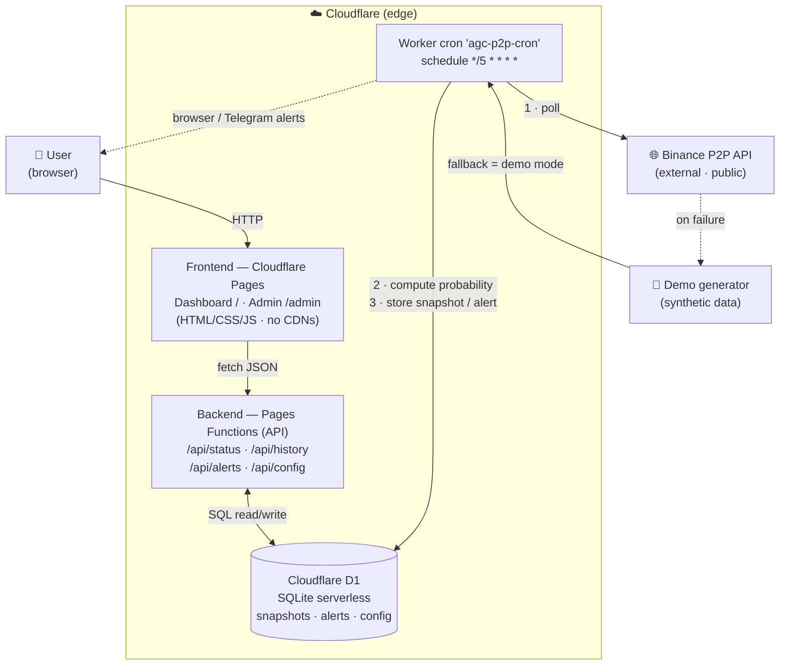
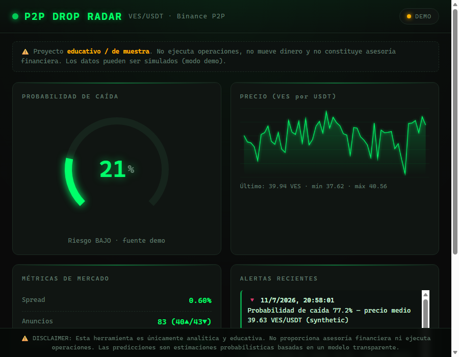
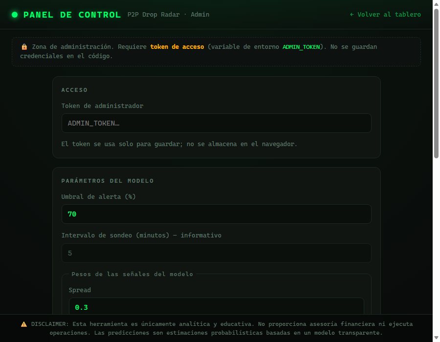

# P2P Drop Radar

[](https://agc-p2p-drop-radar.pages.dev)
[](https://agc-p2p-drop-radar.pages.dev)
[](tests/)
[](#license)

**Real-time price-drop radar for the VES/USDT pair on Binance P2P.**
A professional-grade, self-contained web dashboard that estimates the probability of an
imminent price drop using a transparent, adjustable model — for **educational and
analytical purposes only**.

🔗 **Live demo:** https://agc-p2p-drop-radar.pages.dev

---

## The problem & the solution

**Problem (inspired by a real Upwork-style brief).** Traders operating on Binance's P2P
market for the Venezuelan bolívar (VES) face a fast-moving, opaque market: prices, spreads
and available liquidity shift minute to minute. A common request is a lightweight,
always-on tool that *watches* the P2P order book and warns when conditions suggest a
downward move — **without** touching funds, placing orders, or giving financial advice.

**Solution.** P2P Drop Radar polls the public Binance P2P endpoint on a schedule, stores
a time series of market snapshots, and runs a **transparent probability model** over four
market signals. The result is surfaced on a live, terminal-style dashboard with a gauge,
price chart, market metrics and an alerts feed. If the public API is unreachable, the
system **never breaks**: it falls back to a realistic synthetic data generator (demo mode,
clearly labelled in the UI).

## Architecture



<details><summary>Detailed ASCII view</summary>

```
                         ┌──────────────────────────────────────────────┐
                         │                   USER                        │
                         │        (browser · dashboard + admin)          │
                         └───────────────┬───────────────▲──────────────┘
                                         │ HTTP          │ JSON
                                         ▼               │
             ┌───────────────────────────────────────────────────────────┐
             │                 Cloudflare Pages (edge)                    │
             │   Static frontend            Pages Functions (API)         │
             │   /  · /admin                /api/status  /api/history     │
             │   (HTML/CSS/JS, no CDNs)     /api/alerts  /api/config      │
             └───────────────────────────────────┬───────────────────────┘
                                                  │  read / write (SQL)
                                                  ▼
                         ┌──────────────────────────────────────────────┐
                         │        Cloudflare D1  (SQLite serverless)     │
                         │   snapshots · alerts · config                 │
                         └───────────────────▲──────────────────────────┘
                                             │  INSERT snapshot / alert
                                             │
             ┌───────────────────────────────────────────────────────────┐
             │        Worker cron  "agc-p2p-cron"  (*/5 * * * *)          │
             │   1. fetch Binance P2P  (fallback → synthetic)             │
             │   2. compute probability (weights from `config`)          │
             │   3. store snapshot  ·  raise alert if over threshold     │
             └───────────────────────────────────────────────────────────┘
```

</details>

### Stack & rationale

| Layer        | Choice                        | Why |
|--------------|-------------------------------|-----|
| Frontend     | Vanilla HTML/CSS/JS, no CDNs  | Fully self-contained, zero build step, loads anywhere. |
| Hosting/API  | Cloudflare Pages + Functions  | Global edge, free tier, functions co-located with the DB. |
| Scheduler    | Cloudflare Worker + Cron      | Native `*/5 * * * *` trigger, no server to run. |
| Database     | Cloudflare D1 (SQLite)        | Serverless SQL, low latency next to Functions, zero idle cost — ideal for small/medium time series. |
| Charts/gauge | Hand-drawn `<canvas>`         | No chart library, no external dependency. |

## Features

- **Live dashboard** — probability gauge (0–100 %, colour-coded), price chart, market
  metrics (spread, ad counts, available volume, change speed, imbalance) and a recent
  alerts feed. Auto-refreshes every 30 s.
- **Transparent probability model** — no black box. A documented weighted sum of four
  signals passed through a logistic curve (see below).
- **Admin control panel** (`/admin`) — adjust the alert threshold and the model weights,
  save them (token-protected), and review the alert log.
- **Configurable alerts** — browser notifications and a Telegram webhook (no hard-coded
  credentials; set via environment/secrets).
- **Demo mode / resilience** — if Binance P2P is unreachable, realistic synthetic data
  keeps the whole system running, clearly flagged in the UI.

## Screenshots

**Dashboard**



**Admin panel**



## The probability model

The model is intentionally simple and auditable. It normalises four market signals to
`[0, 1]` (all oriented toward "downward pressure"), combines them as a weighted sum, and
shapes the result with a logistic function into a `0–100` probability.

| Signal      | What it measures                          | Default weight |
|-------------|-------------------------------------------|----------------|
| `spread`    | Sell/buy tension                          | 0.30           |
| `speed`     | Recent price change velocity              | 0.25           |
| `imbalance` | Supply/demand imbalance                   | 0.25           |
| `volume`    | Abnormal available volume                 | 0.20           |

The weights and the alert threshold live in the D1 `config` table and are read **on every
computation** (`src/snapshot.js → loadWeights()` / `calculateProbability()`), so changes
made in the admin panel take effect on the next snapshot — no redeploy required.

## How to deploy

Assumes `CLOUDFLARE_API_TOKEN` and `CLOUDFLARE_ACCOUNT_ID` are set in the environment.

```bash
# 1) Create the D1 database (once) and copy the id into wrangler.toml
npx wrangler d1 create agc-p2p-drop-radar-db

# 2) Apply migrations (tables + default config)
npx wrangler d1 migrations apply agc-p2p-drop-radar-db --local
npx wrangler d1 migrations apply agc-p2p-drop-radar-db --remote

# 3) Set the admin token (secret, never committed)
npx wrangler pages secret put ADMIN_TOKEN --project-name=agc-p2p-drop-radar

# 4) Deploy the frontend + Functions
npx wrangler pages deploy public --project-name=agc-p2p-drop-radar --branch=main

# 5) Deploy the cron Worker (temporary config with main=src/worker.js + crons)
npx wrangler deploy --config wrangler.cron.toml
```

Run the tests locally:

```bash
node --test tests/**/*.test.js
```

## Disclaimer

⚠️ **DISCLAIMER: This tool is purely analytical and educational. It does not provide
financial advice and does not execute any trades. The predictions are probabilistic
estimates produced by a transparent model.** Use it for demonstration purposes only.

## License

MIT — see below. Free to use, modify and share.

---

## 🇪🇸 Resumen en español (bilingüe)

**P2P Drop Radar** es un tablero web en tiempo real que estima la probabilidad de que el
precio del par VES/USDT en Binance P2P esté por caer, usando un modelo **transparente y
ajustable**. Muestra un medidor, una gráfica del precio, métricas del mercado y un feed de
alertas. Si la API pública falla, sigue funcionando con datos simulados (modo demo). Incluye
un panel de administración (`/admin`) para ajustar umbral y pesos.

- **Demo en vivo:** https://agc-p2p-drop-radar.pages.dev
- **Cómo abrirlo:** entra a la URL, o abre `public/index.html` localmente.
- **Tests:** `node --test tests/**/*.test.js` (12 en verde).

⚠️ **DISCLAIMER: Esta herramienta es únicamente analítica y educativa. No proporciona
asesoría financiera ni ejecuta operaciones. Las predicciones son estimaciones
probabilísticas basadas en un modelo transparente.**
